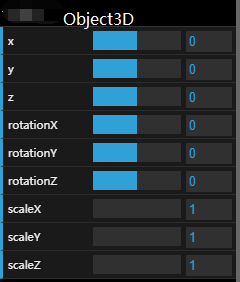
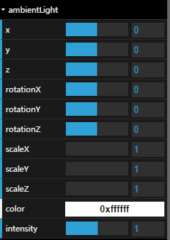
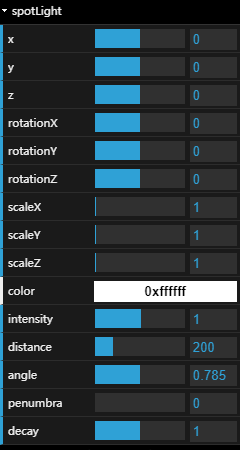
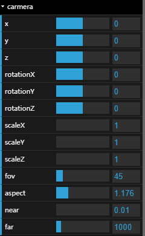

# myGUI - 使用 [dat.gui](https://github.com/dataarts/dat.gui/) 对于 THREE.js 常用对象的封装

## 依赖
* [dat.gui](https://www.npmjs.com/package/dat.gui)
* [three](https://www.npmjs.com/package/three)

## 快速开始
* 复制 myGUI 文件夹到本地项目
* 导入到 js 文件：
```js
import * as myGUI from 'myGUI'
```
* 创建 GUI 对象
```js
const gui = myGUI.createGUI()
```
* 快速套用到 threejs 对象上：
```js
// 套用到 Object3D 对象
myGUI.addObject3DGUI(gui, object3d)

// 套用到光源 Light 对象
myGUI.addLightGUI(gui, light)
myGUI.addLightGUI(gui, ambientLight)
myGUI.addSpotLightGUI(gui, spotLight)

// 套用到聚光灯 SpotLight 对象
myGUI.addSpotLightGUI(gui, spotLight)

// 套用到透视相机 PerspectiveCamera 对象
myGUI.addPerspectiveCameraGUI(gui, camera)
```

## 图例
* myGUI.addObject3DGUI(gui, object3d)

    

* myGUI.addLightGUI(gui, light)

    

* myGUI.addSpotLightGUI(gui, light)

    

* myGUI.addPerspectiveCameraGUI(gui, light)

    

## 其他说明
* myGUI.createGUI() 返回的 GUI 对象是普通的 [dat.gui](https://github.com/dataarts/dat.gui/) 对象，可以直接参考 [dat.gui](https://github.com/dataarts/dat.gui/) 文档使用
